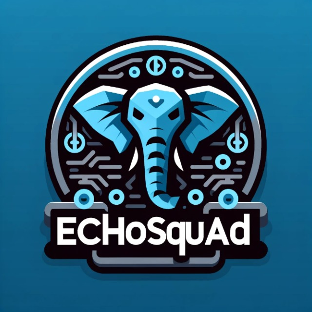

<h1 align="center"> EchoSquad </h1>

<p align="center">
  This directory was created exclusively for use/practicing in the EchoSquad Bootcamp.
</p>

<p align="center">
  
</p>

<p align="center">
  
</p>


## Sobre
The EchoSquad Bootcamp was an experience dedicated to elevating knowledge in programming, providing the opportunity to learn new skills and enhance existing ones.

<hr>

## How to run the exercises
To run the exercises, follow these steps:

1. Open your terminal.
2. Navigate to the exercise directory using the cd command.
3. Run the exercise script with the following command:

```bash 
php '.\POO - Exercises\Exercise1\main.php'
```
